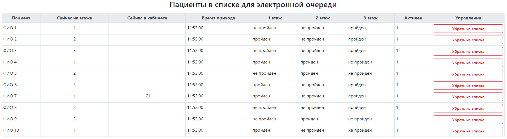
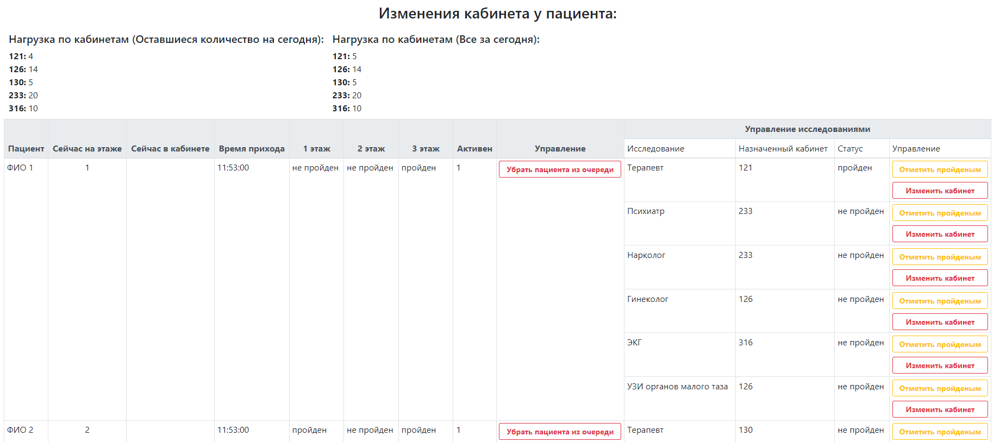
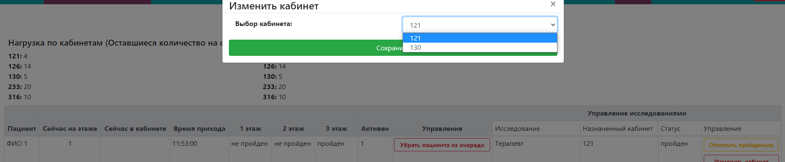
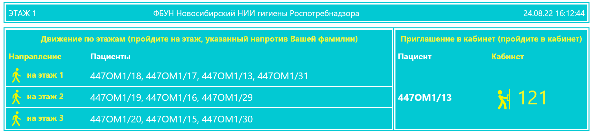

    <h1 align="center">Пример модуля электронной очереди для Yii2</h1>

Пример кода, это модуль электронной очереди, для Yii2, + widget для пользователей, с ролью врач, в модуль добавлены миграции для бд, 
сам же модуль предназначен для распределения пациентов по кабинетам и этажам клиники, для прохождения медицинского осмотра 
У пациента согласно приказу 29н расчитывается перечень обследований, и врачей зависящей от вредных производственных
факторов человека. Модуль рассчитывает нагрузку на этаж, кабинет. Можеть быть несколько кабинетов одинаковых врачей-специалистов (например два спеицалиста Терапевт, один в принимает в 121 кабинете, второй в 130), 
нагрузка на два эти кабента расчитана будет автоматически,
пациенты так же распределяются в зависимости от нагрузки кабинета в течении дня. 

## В данном примере реализованно:
1. [Админская часть](#Админская-часть)
2. [Виджет для врачей](#Виджет-для-врачей)
3. [Электронное табло](#Электронная-табло)

## Админская часть
1. Просмотр пациентов

2. Управление пациентами

3. Управление назначенными кабинетами 

____
[:arrow_up:В данном примере реализованно](#В-данном-примере-реализованно)
___

## Виджет для врачей
Предназначен для выбора и управления пациентами 
1. Widget

2. Widget для врача функционал управления пациентом

____
[:arrow_up:В данном примере реализованно](#В-данном-примере-реализованно)
___

## Электронное табло

____
[:arrow_up:В данном примере реализованно](#В-данном-примере-реализованно)
___
